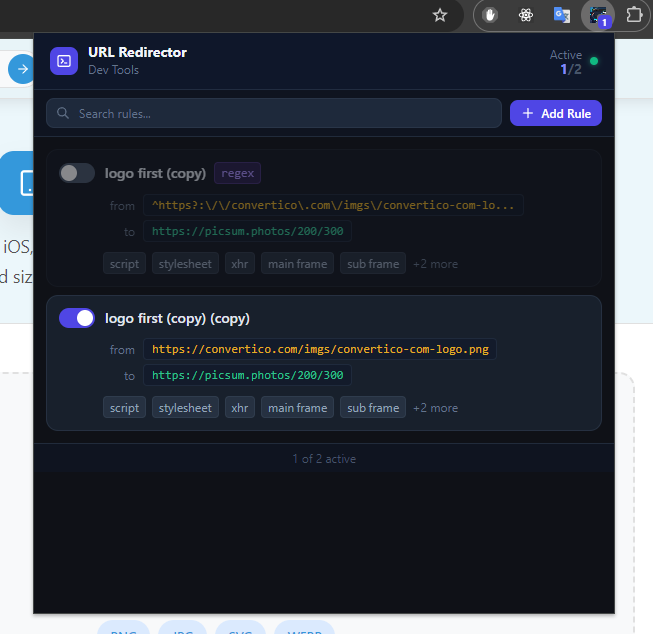
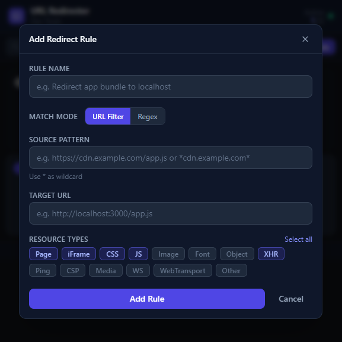
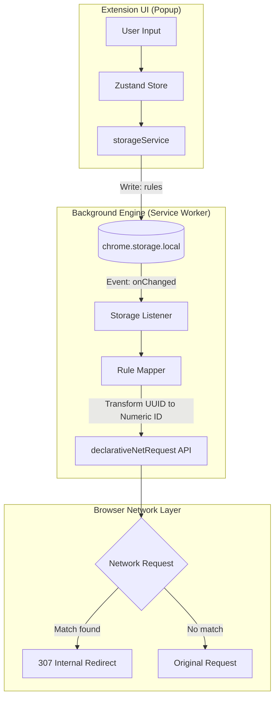

# Resource Redirector & Interceptor (Chrome Extension)

A high-performance Chrome Extension (Manifest V3) designed for developers to intercept, redirect, and modify browser resource requests. This tool is particularly useful for debugging production environments by swapping remote assets with local ones, mocking API responses, or testing new UI components without deployment.

---

## 📸 Screenshots

<p align="center">
  
  
</p>

---

## 🚀 Key Features

- **Granular Interception:** Redirect requests based on exact URLs or complex Regex patterns.
- **Resource Type Filtering:** Limit rules to specific types (Scripts, Stylesheets, Images, XHR/Fetch, etc.).
- **Stable State Management:** Uses Zustand 5 with DevTools integration for a predictable UI state.
- **DNR Engine:** Leverages the modern `chrome.declarativeNetRequest` API for native-speed redirection.
- **Visual Feedback:** Real-time active rule count displayed on the extension badge.
- **Developer Friendly:** Built with TypeScript, Vite, and Tailwind CSS.

---

## 🔄 Redirection Strategies

| Method             | Pattern Example             | Target Example              | Best For                          |
| :----------------- | :-------------------------- | :-------------------------- | :-------------------------------- |
| **Exact Match**    | `https://site.com/app.js`   | `http://localhost/app.js`   | Single file swapping.             |
| **Wildcard**       | `*analytics.js*`            | `https://picsum.photos/200` | Matching files across any domain. |
| **Full Regex**     | `^https?:\/\/site\.com\/.*` | `http://localhost/mock`     | Replacing entire URLs with regex. |
| **Capture Groups** | `^site\.com\/(.*)`          | `localhost:3000/$1`         | Mapping paths between domains.    |

---

## 🏗️ Technical Architecture

The extension follows a decoupled architecture ensuring separation of concerns between the UI and the background execution environment.

### 1. Popup (React UI)

The `src/popup` directory contains the React application. It acts as the command center for the user.

- **State Management:** Uses **Zustand** to handle UI logic (modals, search, filtering).
- **Persistence:** Interacts with `chrome.storage.local` via a dedicated `storageService`. It doesn't handle browser redirects directly; instead, it simply manages the "Source of Truth" in storage.
- **Tech:** React 18, Tailwind CSS (for styling), and primitive UI components (Button, Input, Toggle).

### 2. Service Worker (Background Script)

Located in `src/background/index.ts`, this is a non-persistent script that handles the heavy lifting.

- **Reactive Synchronization:** It listens for `chrome.storage.onChanged`. When rules are updated in the Popup, the worker wakes up, hashes the rule IDs into stable integers, and synchronizes them with the browser's redirect engine.
- **Badge Management:** Updates the extension icon's badge text to reflect the current count of active rules.

### 3. Shared Utilities & Logic

- **Rule Mapper:** A critical utility that converts application-level UUID-based rules into stable, numeric-ID rules required by the `chrome.declarativeNetRequest` API.
- **Storage Service:** A wrapper around the Chrome Storage API that provides a clean, Promise-based interface for the rest of the app.

---

## 📊 Data Flow Diagram



---

## 🛠️ Engineering Highlights

- **Stable Integer Hashing:** Chrome's `declarativeNetRequest` requires rules to have `integer` IDs. To maintain consistency and avoid rule conflicts during updates, I implemented a stable hashing function that maps UUID strings to a safe 32-bit integer range.
- **Performance:** By using the **Declarative** API instead of the legacy `webRequest` API, redirection happens at the browser's C++ level before the request is even sent, resulting in zero latency for the user.
- **Type Safety:** The entire codebase is written in **TypeScript**, ensuring that data structures passed between the Popup and the Service Worker are consistent and bug-free.

---

## 🛠️ Development & Build

### Prerequisites

- Node.js (v18+)
- Yarn or NPM

### Commands

```bash
# Install dependencies
yarn install

# Run Vitest suite (Unit & Integration tests)
yarn run test

# Start Dev Server with HMR (Hot Module Replacement)
yarn run dev

# Build for production
yarn run build
```

### Installation in Chrome

1. Open `chrome://extensions/`
2. Enable **Developer mode** (top right).
3. Click **Load unpacked** and select the `dist/` folder.
